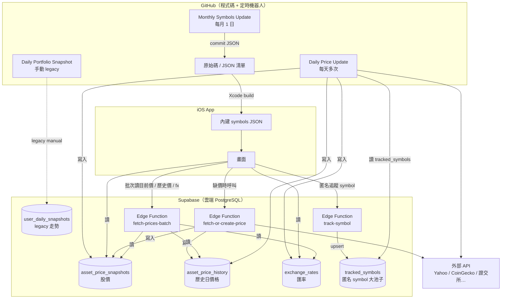

# Snapvest 工程手冊

> 給開發者／維護者看的白話說明：GitHub、Supabase、App 各自做什麼、每天幾點更新、股價從哪來、檔案在哪裡。
>
> **Repo：** [github.com/david04129/Snapvest](https://github.com/david04129/Snapvest)  
> **初次設定教學：** [STEP_BY_STEP_SETUP.md](./STEP_BY_STEP_SETUP.md)  
> **Symbols 腳本細節：** [scripts/README.md](./scripts/README.md)

---

## 目錄

1. [三句話搞懂架構](#三句話搞懂架構)
2. [整體架構圖](#整體架構圖)
3. [資料分兩大類](#資料分兩大類)
4. [GitHub 是什麼？做什麼？](#github-是什麼做什麼)
5. [Supabase 是什麼？做什麼？](#supabase-是什麼做什麼)
6. [Supabase SQL 在做什麼？](#supabase-sql-在做什麼)
7. [iOS App 讀寫什麼？](#ios-app-讀寫什麼)
8. [每日／每月自動排程總表](#每日每月自動排程總表)
9. [股價與匯率：用什麼 API？](#股價與匯率用什麼-api)
10. [股票代號清單（Symbols）怎麼來？](#股票代號清單symbols怎麼來)
11. [重要檔案與目錄](#重要檔案與目錄)
12. [金鑰與設定](#金鑰與設定)
13. [常見問題](#常見問題)
14. [手動操作速查](#手動操作速查)

---

## 三句話搞懂架構

| 角色 | 一句話 |
|------|--------|
| **GitHub** | 放程式碼的地方，也是「定時機器人」——自動跑腳本、更新 JSON 清單、把股價寫進 Supabase |
| **Supabase** | 雲端資料庫——存股價、匯率、走勢圖等「會每天變」的資料；App 上線後連它讀資料 |
| **App（iPhone）** | 你寫的 SwiftUI 程式——顯示畫面；從 Supabase 拿股價；從 App 內建 JSON 搜尋股票代號 |

**記住這個差別：**

- **代號清單**（symbols）→ 存在 **GitHub**，打包進 App，**不經 Supabase**
- **股價／匯率／走勢** → 存在 **Supabase**，App **即時讀取**，不用發新版也能看到新股價

---

## 整體架構圖



---

## 資料分兩大類

### A 類：打包在 App 裡（跟 GitHub 有關）

| 內容 | 存在哪 | 誰更新 | App 怎麼拿到 |
|------|--------|--------|--------------|
| 台股／美股／加密 **代號 + 名稱** | GitHub repo → Xcode Bundle | 每月 GitHub Actions 或本機 `build_all.sh` | **發新版 App** 才會更新 |
| CoinGecko 對照表（給後端抓加密價用） | `backend/scripts/data/crypto_coingecko_map.json` | 同上 | App 不直接讀 |

### B 類：存在 Supabase（App 即時讀）

| 內容 | 資料表 | 誰寫入 | App 用途 |
|------|--------|--------|----------|
| 各檔股價 | `asset_price_snapshots` | 每日腳本 + Edge Function | 顯示現價、算損益；`current_price_source` / `previous_price_source` |
| 各檔歷史日價格 | `asset_price_history` | 每日腳本 + Edge Function | App 補齊本機走勢圖缺失日期 |
| 全站最後更新時間 | `price_update_metadata` | 每日腳本 | 判斷要不要刷新 |
| 匿名追蹤池 | `tracked_symbols` | App 透過 `track-symbol` 只送 asset type + symbol | **唯一**排程抓價來源（`is_active=true`） |
| 匯率 | `exchange_rates` | 每日腳本 | 台幣／美金換算 |

> `hot_stocks` / `hot_stocks_seed` / `hot_stocks_backup` 已退役（migration 021），表保留僅供查詢，程式不再讀寫。

---

## GitHub 是什麼？做什麼？

**GitHub** = 你的程式碼倉庫 + 自動化工人。

- **倉庫：** [https://github.com/david04129/Snapvest](https://github.com/david04129/Snapvest)
- **Actions 頁面：** [https://github.com/david04129/Snapvest/actions](https://github.com/david04129/Snapvest/actions)

GitHub 在 Snapvest 裡主要做三件事：

1. **存程式碼**（Swift、Python、SQL、JSON）
2. **定時跑 Workflow**（股價更新、走勢計算、symbols 建置）
3. **symbols 有變時自動 commit**（機器人帳號 `github-actions[bot]` push 回 `main`）

> GitHub **不是**資料庫。股價不會長期存在 GitHub，只有「腳本跑完後寫進 Supabase」。

---

## Supabase 是什麼？做什麼？

**Supabase** = 託管的 PostgreSQL 資料庫 + 可選的 Edge Function（小後端）。

- **官網：** [https://supabase.com](https://supabase.com)
- **Dashboard：** 登入後進你的專案（例如 Project URL 像 `https://xxxxx.supabase.co`）

Snapvest 用 Supabase 當「**會變動資料的倉庫**」：

- App 用 **anon / publishable key** **讀**股價、匯率、走勢
- GitHub Actions 用 **service_role key** **寫**股價、匯率、走勢
- Edge Function 在資料庫沒某檔價格時，**即時去外部 API 抓**再寫入

---

## Supabase SQL 在做什麼？

`backend/supabase/migrations/*.sql` 這些檔案 = **蓋資料庫骨架的設計圖**。

你要在 [Supabase SQL Editor](https://supabase.com/docs/guides/database/overview) 裡**手動執行**（新功能時再跑新的 migration），**不是每天自動跑**。

| 檔案 | 建立什麼 | 用途 |
|------|----------|------|
| [001_price_tables.sql](./backend/supabase/migrations/001_price_tables.sql) | `asset_price_snapshots`、`price_update_metadata`、`hot_stocks` | 股價與熱門股 |
| [002_rls_policies.sql](./backend/supabase/migrations/002_rls_policies.sql) | RLS 權限 | App 只能讀、不能亂改 |
| [003_exchange_rates.sql](./backend/supabase/migrations/003_exchange_rates.sql) | `exchange_rates` | 匯率表 |
| [004_exchange_rates_write_policy.sql](./backend/supabase/migrations/004_exchange_rates_write_policy.sql) | service_role 寫入權限 | 給 GitHub Actions 寫匯率 |
| [005_user_portfolio_state.sql](./backend/supabase/migrations/005_user_portfolio_state.sql) | `user_portfolio_state` | Legacy：local-first 後 App 不再寫入 |
| [006_user_daily_snapshots.sql](./backend/supabase/migrations/006_user_daily_snapshots.sql) | `user_daily_snapshots` | Legacy：首頁走勢圖改讀本機 |
| [007_hot_stocks_seed_and_backup.sql](./backend/supabase/migrations/007_hot_stocks_seed_and_backup.sql) | `hot_stocks_seed`、`hot_stocks_backup` | 種子清單與備份 |
| [008_price_source.sql](./backend/supabase/migrations/008_price_source.sql) | `asset_price_snapshots.price_source` | 標記股價來源 |
| [009_price_snapshot_eod_columns.sql](./backend/supabase/migrations/009_price_snapshot_eod_columns.sql) | 收盤日 + 更新時間欄位 | 取代 `current_price_date` / `last_updated` 等 |
| [010_price_source_current_previous.sql](./backend/supabase/migrations/010_price_source_current_previous.sql) | `current_price_source`、`previous_price_source` | 取代單一 `price_source` |
| [011_price_snapshot_column_order.sql](./backend/supabase/migrations/011_price_snapshot_column_order.sql) | 欄位顯示順序 | source 緊接在對應 updated_at 後 |
| [012_exchange_rates_previous.sql](./backend/supabase/migrations/012_exchange_rates_previous.sql) | `previous_rate`、`previous_updated_at` | 本輪抓不到時沿用上一輪 |
| [014_tracked_symbols.sql](./backend/supabase/migrations/014_tracked_symbols.sql) | `tracked_symbols` | 匿名全站 symbol 大池子；撤銷 App 對 legacy 使用者快照表權限 |
| [018_asset_price_history.sql](./backend/supabase/migrations/018_asset_price_history.sql) | `asset_price_history` | 公開 symbol 歷史日價格，供 App 本機補點 |
| [019_market_calendar.sql](./backend/supabase/migrations/019_market_calendar.sql) | `market_calendar` | 台／美交易日曆（盤中判斷） |
| [020_snapshot_price_kind.sql](./backend/supabase/migrations/020_snapshot_price_kind.sql) | `price_kind` | `intraday`／`close`，App 顯示用 |
| [021_hot_stocks_deprecated.sql](./backend/supabase/migrations/021_hot_stocks_deprecated.sql) | — | 標記 `hot_stocks*` 退役；抓價僅 `tracked_symbols` |

**`asset_price_snapshots` 欄位順序：** 代號 → 現價 → 收盤日 → 更新時間 → **現價來源** → 上次價 → 上次收盤日 → 上次更新時間 → **上次來源**。

**RLS（Row Level Security）白話：** 像門禁——App 的 key 只能進「讀取區」；GitHub Actions 的 service_role key 才能「寫入區」。

---

## iOS App 讀寫什麼？

### App 從 Supabase 讀

| 功能 | Swift 檔案 | 讀哪張表 |
|------|------------|----------|
| 顯示股價 | [SupabasePriceService.swift](./Snapvest/Snapvest/Services/SupabasePriceService.swift) → Edge Function `fetch-prices-batch` | `asset_price_snapshots` |
| 補走勢缺口用歷史價 | 同上 → `fetch-prices-batch` | `asset_price_history` |
| 缺價時即時抓 | 同上 → 呼叫 Edge Function | 寫入後回傳 |
| 匯率 | [PriceService.swift](./Snapvest/Snapvest/Services/PriceService.swift) 等 | `exchange_rates` |

`fetch-prices-batch` 是目前價與補點歷史價的主路徑：App 一次提交所有持股 symbol 與可選日期區間，回收 compact maps / matrix（current、history、fx）。DEBUG build 會在 Xcode Console 印出 `[SupabasePriceService] batch request ...`、`batch response ...`、`fetchPrices using batch ...`；若 batch function 失敗或沒有 current snapshots，才會印出 fallback 並退回舊的逐檔 REST 查詢。

### App 從本機讀

| 功能 | Swift 檔案 | 讀哪裡 |
|------|------------|--------|
| 首頁走勢圖 | [HomeTrendChartView.swift](./Snapvest/Snapvest/Views/HomeTrendChartView.swift) → `LocalDailyTrendSnapshot` | 本機 JSON `dailyTrendSnapshotsByDate` |

App 每次產生 / 儲存 `HomeDashboardSnapshot` 都會覆蓋今天的本機 daily trend snapshot。每天第一次啟動時，`LocalDailyTrendBackfillService` 會補 / 覆蓋昨天點，並補齊最後一筆本機走勢點到昨天之間的缺口；補點時只用本機帳本狀態 + Supabase 公開價格 / 匯率。

缺價規則：

- `fetch-prices-batch` 查缺口區間時會往前多抓 14 天，讓 App 能對每檔 symbol 做 forward-fill。
- 台股 / 美股週末、休市或單日缺價時，沿用該檔上一個可用收盤價。
- 少數 symbol 完全沒價時略過該檔，不讓整天補點失敗；整天完全沒有任何歷史 / 前值價格時才不寫入該日走勢點。
- 補出的點持久化在手機；首頁走勢圖不讀 Supabase `user_daily_snapshots` fallback。

### App 寫入 Supabase

| 功能 | Swift 檔案 | 寫哪張表 |
|------|------------|----------|
| 交易後匿名追蹤公開標的 | [SupabaseTrackedSymbolService.swift](./Snapvest/Snapvest/Services/SupabaseTrackedSymbolService.swift) → Edge Function `track-symbol` | `tracked_symbols` |

> App 不再寫 `user_portfolio_state` 或雲端 daily snapshots。首頁走勢圖讀手機本機 daily trend snapshots。

### App 讀本機 Bundle（不連網）

| 功能 | Swift 檔案 | 資料來源 |
|------|------------|----------|
| 選股搜尋、台股簡稱 | [SymbolListService.swift](./Snapvest/Snapvest/Services/SymbolListService.swift) | `Snapvest/Snapvest/Resources/Symbols/*.json` |

### 帳戶／交易紀錄（目前狀態）

目前核心交易資料保存在 App 本機資料層。  
也就是說：**買賣紀錄、現金、負債、成本與走勢點不進 Supabase**；App 只會匿名提交公開 `asset_type + symbol` 給 `tracked_symbols`，讓後端知道要抓哪些公開市場價格。

---

## 每日／每月自動排程總表

以下時間皆為 **台灣時間（UTC+8）**。  
**盤中每 15 分鐘**、**加密每小時**由 [Cloud Run](./backend/cloud-run/README.md) 執行 `daily_price_update.py --mode …`（見 [MARKET_PRICE_AND_SESSION_SPEC.md](./MARKET_PRICE_AND_SESSION_SPEC.md)）。

### Cloud Run（主排程）

| 模式 | 頻率 | 更新範圍 | 寫入 |
|------|------|----------|------|
| `intraday` | 台／美盤中每 15 分 | `tracked_symbols` | 僅 `asset_price_snapshots`（`price_kind=intraday`） |
| `close` | 台 14:00、美 07:00 | `tracked_symbols` | snapshots + **`asset_price_history`（收盤價）** |
| `crypto_hourly` | 每小時（**00:00** 另寫昨日 history） | tracked 加密 | snapshots；00:00 另寫 **`asset_price_history`（`price_date`＝昨日）** |
| `exchange` | 每日 1 次 | 6 幣匯率 | `exchange_rates` |
| `calendar` | 每日 06:00 | — | `market_calendar` |

### GitHub Actions（低頻備援）

| 時間 | Workflow 名稱 | 做什麼 | 寫到哪 |
|------|---------------|--------|--------|
| **週一～五 18:00** | [Daily Price Update](./.github/workflows/daily-price-update.yml) | `close`（tracked_symbols 備援） | Supabase |
| **週六、日 18:00** | 同上 | 只更新加密 | Supabase |
| **週二～六 07:00** | 同上 | 只更新美股 | Supabase |

#### 一天時間軸（平日）

```
06:00  同步交易日曆（market_calendar）
09:00–13:30  台股盤中每 15 分（tracked → snapshots）
14:00  台股收盤價 + 匯率 → snapshots + history
22:30–05:00  美股盤中每 15 分
07:00  美股收盤價 → snapshots + history
每小時  加密 snapshots；**00:00** 加密寫昨日 history
App 啟動／下拉 → 只讀 DB（fetch-prices-batch）
```

#### 週末

```
週六 18:00  只更新加密
週日 18:00  只更新加密
（美股／台股週末不開盤，週一 07:00 / 18:00 再更新）
```

### 每月

| 時間 | Workflow 名稱 | 做什麼 | 寫到哪 |
|------|---------------|--------|--------|
| **每月 1 日 10:00** | [Monthly Symbols Update](./.github/workflows/monthly-symbols-update.yml) | 重抓台股／美股／加密代號清單 | **GitHub**（commit JSON） |

若清單跟上次完全一樣 → 不 commit，顯示「無變動，略過 commit」。

### 手動觸發

三個 Workflow 都支援 **Run workflow**（在 Actions 頁面），不用等到排程時間。

---

## 股價與匯率：用什麼 API？

Snapvest 有 **三條抓價路線**：

1. **每日批量更新**（GitHub Actions → Python）
2. **App 批次讀目前價 / 歷史價**（Edge Function `fetch-prices-batch`）
3. **App 新增冷門標的、DB 還沒價格時**（Edge Function 即時抓）

---

### 1. 每日批量更新（`daily_price_update.py`）

**腳本位置：** [backend/scripts/daily_price_update.py](./backend/scripts/daily_price_update.py)  
**Workflow：** [.github/workflows/daily-price-update.yml](./.github/workflows/daily-price-update.yml)

**更新哪些股票？**  
不是全市場每一檔，而是：

- 僅 **`tracked_symbols`**（`is_active=true`，App 匿名 `track-symbol` 累積的全站池）
- `fetch-or-create-price` 僅寫 `asset_price_snapshots`（單檔補價；**不**寫 history，避免盤中價污染日線）
- **盤中 job 不寫** `asset_price_history`；台／美 history 僅 **close job**；加密 history 僅 **crypto_hourly 台北 00:00**（`price_date`＝昨日）

| 資料 | API | 連結 | 備註 |
|------|-----|------|------|
| **匯率** | FinMind `TaiwanExchangeRate`（台銀牌告） | [FinMind 匯率](https://finmind.github.io/tutor/ExchangeRate/) | 與台股同輪更新；USD/EUR/JPY/CNY/HKD/AUD → TWD |
| **台股** | Fugle `intraday/quote` | [Fugle 行情](https://developer.fugle.tw/) | 盤中／收盤同一 API；`source=fugle`；失敗保留 DB |
| **美股** | Finnhub `/quote` | [Finnhub](https://finnhub.io/) | 主線；失敗 → 60s 重試 → `yfinance` |
| **加密貨幣** | CoinGecko Simple Price | [CoinGecko API 文件](https://docs.coingecko.com/reference/simple-price) | 曆日快照；需 `crypto_coingecko_map.json` |

排程會印出**本輪交易日**（台股台北曆日、美股紐約曆日），寫入 `current_close_date`；`current_updated_at` 為寫入時間（到秒）。`price_kind`：`intraday`＝盤中快照、`close`＝收盤價（才寫 history）。Cloud Run Secrets 需 **`FUGLE_API_KEY`**（台股）、**`FINNHUB_API_KEY`**（美股）、**`FINMIND_TOKEN`**（匯率／台股日曆）。

**加密 symbol 對照表：** [backend/scripts/data/crypto_coingecko_map.json](./backend/scripts/data/crypto_coingecko_map.json)（由 `build_symbols_crypto.py` 產生）

---

### 2. 批次讀價（Edge Function `fetch-prices-batch`）

**程式位置：** [backend/supabase/functions/fetch-prices-batch/index.ts](./backend/supabase/functions/fetch-prices-batch/index.ts)

**什麼時候觸發？**

- App 刷新目前所有持股價格時。
- 本機 daily trend snapshots 補缺口時，需要一段日期內所有持股的歷史價與匯率。

**回傳方式：**

- `current`：`asset_type:symbol -> price`
- `history`：`asset_type:symbol -> [prices aligned to dates]`
- `fx`：例如 `USD:TWD`
- 缺失價格保留 `null`，App 端再做前值延續。

**簡單防濫用限制：**

- 單次最多 100 檔 symbol。
- 歷史區間最多 120 天。
- `symbols × dates` 最多 6000 格價格資料。

**部署方式：**

```bash
cd backend
supabase functions deploy fetch-prices-batch --no-verify-jwt
```

### 3. 即時取價（Edge Function `fetch-or-create-price`）

**程式位置：** [backend/supabase/functions/fetch-or-create-price/index.ts](./backend/supabase/functions/fetch-or-create-price/index.ts)

台股／美股自 Yahoo `range=5d` 取現價與昨收（`chartPreviousClose` 或倒數第二根日 K），寫入 `previous_price` / `previous_close_date` 供新增標的日漲跌；不寫 `asset_price_history`。

**什麼時候觸發？**  
App 查 `asset_price_snapshots` 發現**沒有這檔的價格**時，會 POST 這支 Function。

| 資產 | API | 連結 | 備註 |
|------|-----|------|------|
| **台股** | Yahoo Finance Chart API | `https://query1.finance.yahoo.com/v8/finance/chart/{代號}.TW` | 例：`2330.TW` |
| **美股** | Yahoo Finance Chart API | `https://query1.finance.yahoo.com/v8/finance/chart/{代號}` | 例：`AAPL` |
| **加密** | CoinGecko Simple Price | [Simple Price API](https://docs.coingecko.com/reference/simple-price) | 可帶 `coingeckoId`；也會搜尋 CoinGecko |

抓到價格後會寫入 `asset_price_snapshots` 與 `asset_price_history`（`current_price_source`：`yahoo` 或 `coingecko`；不加入 `hot_stocks`）

**來源欄常見值：** 排程 `fugle`（台股）／`finnhub`／`yfinance`（美股備援）／`coingecko`／`finmind`（匯率）；Edge `yahoo`／`coingecko`（`fetch-or-create-price` 台股仍 Yahoo）。本輪抓失敗未 upsert 的列，**現價與 `current_*` 皆維持上一輪**。

**部署方式（手動，不經 GitHub Actions）：**

```bash
cd backend
supabase link --project-ref 你的專案ID
supabase functions deploy fetch-or-create-price
supabase functions deploy fetch-prices-batch --no-verify-jwt
```

Supabase CLI 文件：[Edge Functions](https://supabase.com/docs/guides/functions)

---

### 股價流程（白話版）

```
你打開 App 要看某檔股價
        │
        ▼
先查 Supabase 資料庫有沒有？
        │
   有 ──┴── 沒有
   │         │
   ▼         ▼
直接顯示   呼叫 Edge Function
           去 Yahoo / CoinGecko 抓
           寫入 DB 再顯示

另外，GitHub 每天定時跑腳本
批量更新「你有持有 + 熱門」的價格
```

---

## 股票代號清單（Symbols）怎麼來？

**目的：** 讓使用者在 App 裡搜尋「2330」「AAPL」「BTC」時找得到名稱。

### 資料來源

| 市場 | 腳本 | 外部來源 | 連結 |
|------|------|----------|------|
| **美股** | [build_symbols_us.py](./scripts/build_symbols_us.py) | NASDAQ 官方清單 | [nasdaqtraded.txt](https://www.nasdaqtrader.com/dynamic/SymDir/nasdaqtraded.txt) |
| **台股** | [build_symbols_tw.py](./scripts/build_symbols_tw.py) | 證交所上市 CSV（**公司簡稱**）+ 櫃買上櫃／興櫃 + ETF 手動補充 | [證交所 open data CSV](https://dts.twse.com.tw/opendata/t187ap03_L.csv)、[櫃買中心](https://www.tpex.org.tw/) |
| **加密** | [build_symbols_crypto.py](./scripts/build_symbols_crypto.py) | CoinGecko 市值 Top 500 | [CoinGecko Markets API](https://docs.coingecko.com/reference/coins-markets) |

### 建置流程

```bash
cd scripts
./build_all.sh
```

`build_all.sh` 會依序：

1. **備份**現有清單到 `scripts/output/archive/`（每種最多留 2 版舊檔）
2. 建置 `symbols_tw.json` / `symbols_us.json` / `symbols_crypto.json`
3. 建 `symbols_manifest.json`（版本摘要）
4. 同步到 App Bundle：`Snapvest/Snapvest/Resources/Symbols/`

### 產出檔案位置

| 用途 | 路徑 |
|------|------|
| App 打包用 | [Snapvest/Snapvest/Resources/Symbols/](./Snapvest/Snapvest/Resources/Symbols/) |
| 建置中間產物 | [scripts/output/](./scripts/output/) |
| **舊版備份**（最多 2 份） | [scripts/output/archive/](./scripts/output/archive/) |
| 後端加密對照 | [backend/scripts/data/crypto_coingecko_map.json](./backend/scripts/data/crypto_coingecko_map.json) |

### 自動更新 vs 手動

| 方式 | 說明 |
|------|------|
| **每月自動** | GitHub Actions `Monthly Symbols Update` → 有變就 commit 到 `main` |
| **本機手動** | 發 App 新版前可再跑 `./build_all.sh` 確保最新 |
| **使用者何時看到新清單** | 必須 **重新安裝／更新 App**（因為 JSON 打包在 App 裡） |

### 若自動更新壞了，怎麼還原？

1. 到 `scripts/output/archive/` 找舊版，例如 `archive/tw/symbols_tw_v8_2026-05-24.json`
2. 複製覆蓋回：
   - `scripts/output/symbols_*.json`
   - `Snapvest/Snapvest/Resources/Symbols/symbols_*.json`
3. commit 並重新 build App

---

## 重要檔案與目錄

```
Snapvest/
├── Snapvest/Snapvest/          # iOS App 原始碼
│   ├── Resources/Symbols/      # 打包進 App 的代號清單
│   └── Services/               # Supabase 連線、股價、走勢
├── backend/
│   ├── scripts/
│   │   ├── daily_price_update.py          # 每日股價／匯率
│   │   ├── daily_portfolio_snapshot.py    # 每日淨資產走勢
│   │   └── data/crypto_coingecko_map.json
│   └── supabase/
│       ├── migrations/         # SQL 建表（手動在 Supabase 執行）
│       └── functions/
│           ├── fetch-prices-batch/      # 批次讀目前價 / 歷史價 / fx
│           ├── fetch-or-create-price/   # 即時抓價
│           └── track-symbol/            # 匿名追蹤公開 symbol
├── scripts/
│   ├── build_all.sh            # 一鍵建 symbols
│   ├── archive_symbols.py      # 備份舊版清單
│   └── output/                 # 建置產物 + archive/
├── .github/workflows/          # GitHub Actions 排程
├── docs/
│   ├── API_ABUSE_MITIGATION_AND_PR3.md  # Edge 防濫用、PR1–PR3 規格
│   └── PHASE_A_ANONYMOUS_AUTH_VERIFICATION.md  # Anonymous Auth 驗證步驟
├── STEP_BY_STEP_SETUP.md       # 從零設定 Supabase 教學
└── ENGINEERING_HANDBOOK.md     # 本文件
```

---

## 金鑰與設定

### GitHub Secrets（給 Actions 用）

路徑：Repo → **Settings** → **Secrets and variables** → **Actions**

| Secret | 用途 | 哪個 Workflow 需要 |
|--------|------|-------------------|
| `SUPABASE_URL` | Supabase 專案網址 | Daily Price、Edge Functions、Legacy Manual Snapshot |
| `SUPABASE_SERVICE_ROLE_KEY` | 後端寫入權限（**不可放 App**） | 同上 |

文件：[GitHub Encrypted secrets](https://docs.github.com/en/actions/security-guides/using-secrets-in-github-actions)

### App 設定（Info.plist）

| Key | 用途 |
|-----|------|
| `SUPABASE_URL` | Supabase 專案 URL |
| `SUPABASE_ANON_KEY` | App 讀取用（publishable 或 anon JWT） |
| `SUPABASE_ANON_JWT` | 選填；呼叫 Edge Function 時的 Bearer |

載入邏輯：[SupabaseConfigLoader.swift](./Snapvest/Snapvest/Utilities/SupabaseConfigLoader.swift)

在 Supabase Dashboard 找這些值：**Project Settings → API**  
文件：[Supabase API Keys](https://supabase.com/docs/guides/api/api-keys)

---

## 常見問題

### Q：我更新了 symbols，為什麼 App 還是舊的？

因為 symbols 是**打包在 App 裡**的，不是從 Supabase 下載。需要 **Xcode 重新 build 並發新版**。

### Q：股價需要發新版 App 嗎？

**不需要。** 股價在 Supabase，App 每次開啟會去讀資料庫。

### Q：GitHub 自動 commit 是什麼？

Monthly Symbols Update 跑完後，若 JSON 有變，機器人會自動 `git commit` + `push` 到 `main`。你可以在 [Commits](https://github.com/david04129/Snapvest/commits/main) 搜尋 `chore(symbols):`。

### Q：Supabase SQL 要每天跑嗎？

**不用。** 只有第一次建專案、或加新功能（新 migration）時跑。

### Q：排程沒跑怎麼辦？

1. 到 [Actions](https://github.com/david04129/Snapvest/actions) 手動 **Run workflow** 測試  
2. 檢查 Secrets 是否設定  
3. 確認 workflow 檔在 `main` 分支（cron 只跑 default branch）  
4. GitHub 免費方案排程可能延遲 15 分鐘～1 小時；repo 長期無活動可能暫停  

詳細排查可見 [STEP_BY_STEP_SETUP.md](./STEP_BY_STEP_SETUP.md) 或 [BACKEND_AND_APIS.md](./BACKEND_AND_APIS.md) 第六節。

### Q：美股有簡短公司名嗎？

目前美股清單來自 NASDAQ 的 **完整 Security Name**（例如 `Apple Inc. Common Stock`），**沒有像台股那樣的「公司簡稱」欄位**。若要簡稱需另接 API 或規則處理。

---

## 手動操作速查

| 想做什麼 | 怎麼做 |
|----------|--------|
| 手動更新股價／匯率 | [Actions → Daily Price Update → Run workflow](https://github.com/david04129/Snapvest/actions/workflows/daily-price-update.yml) |
| 手動算 legacy 雲端走勢 | [Actions → Daily Portfolio Snapshot → Run workflow](https://github.com/david04129/Snapvest/actions/workflows/daily-portfolio-snapshot.yml) |
| 手動更新 symbols | [Actions → Monthly Symbols Update → Run workflow](https://github.com/david04129/Snapvest/actions/workflows/monthly-symbols-update.yml) |
| 本機測股價腳本 | `cd backend/scripts && export SUPABASE_URL=... SUPABASE_SERVICE_ROLE_KEY=... && python daily_price_update.py` |
| 本機建 symbols | `cd scripts && ./build_all.sh` |
| 部署 Edge Function | `cd backend && supabase functions deploy fetch-or-create-price && supabase functions deploy track-symbol && supabase functions deploy fetch-prices-batch --no-verify-jwt` |
| 在 Supabase 看股價表 | Dashboard → **Table Editor** → `asset_price_snapshots` |
| 看 GitHub 上的 symbols JSON | [Resources/Symbols/](https://github.com/david04129/Snapvest/tree/main/Snapvest/Snapvest/Resources/Symbols) |

---

## 相關外部連結整理

| 服務 | 連結 |
|------|------|
| GitHub Repo | [github.com/david04129/Snapvest](https://github.com/david04129/Snapvest) |
| GitHub Actions | [Snapvest Actions](https://github.com/david04129/Snapvest/actions) |
| Supabase | [supabase.com](https://supabase.com) |
| Supabase 文件 | [supabase.com/docs](https://supabase.com/docs) |
| NASDAQ 美股清單 | [nasdaqtraded.txt](https://www.nasdaqtrader.com/dynamic/SymDir/nasdaqtraded.txt) |
| 證交所上市 CSV | [t187ap03_L.csv](https://dts.twse.com.tw/opendata/t187ap03_L.csv) |
| 櫃買中心 | [tpex.org.tw](https://www.tpex.org.tw/) |
| CoinGecko API | [docs.coingecko.com](https://docs.coingecko.com/) |
| 匯率 API | [open.er-api.com](https://open.er-api.com/) |
| Yahoo Finance（非官方） | [query1.finance.yahoo.com](https://query1.finance.yahoo.com/) |
| yfinance（Python） | [github.com/ranaroussi/yfinance](https://github.com/ranaroussi/yfinance) |
| 政府資料開放平台（台股備援 CSV） | [data.nat.gov.tw](https://data.nat.gov.tw/dataset/18419) |

---

*最後更新：2026-05-30。若程式有改動，以 repo 內實際檔案為準。*
